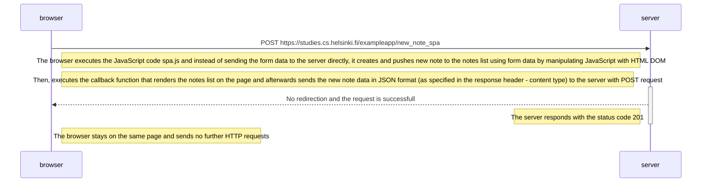

```mermaid
sequenceDiagram
    participant browser
    participant server

    browser->>server: POST  https://studies.cs.helsinki.fi/exampleapp/new_note_spa
    Note right of browser: The browser executes the JavaScript code spa.js and instead of sending the form data to the server directly, it creates and pushes new note to the notes list using form data by manipulating JavaScript with HTML DOM 
    Note right of browser: Then, executes the callback function that renders the notes list on the page and afterwards sends the new note data in JSON format (as specified in the response header - content type) to the server with POST request  
    activate server
    server-->>browser: No redirection and the request is successfull
    Note left of server: The server responds with the status code 201
    deactivate server
    Note right of browser: The browser stays on the same page and sends no further HTTP requests
    
    
```
